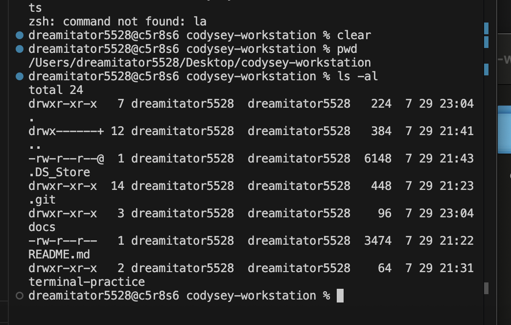
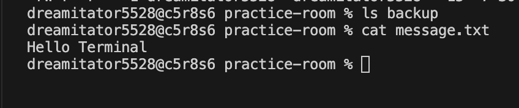
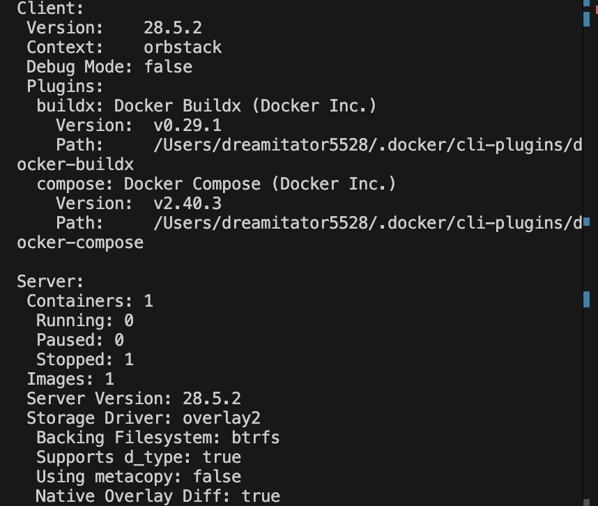
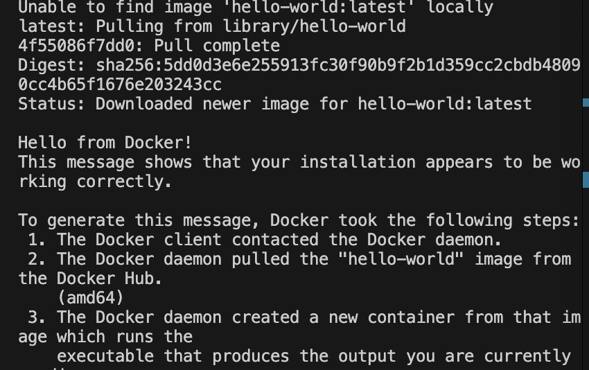
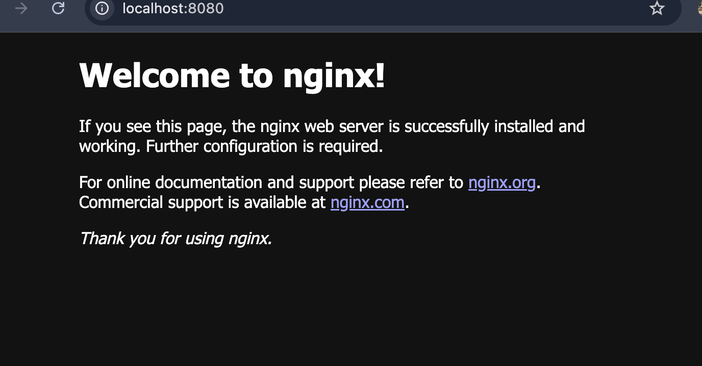
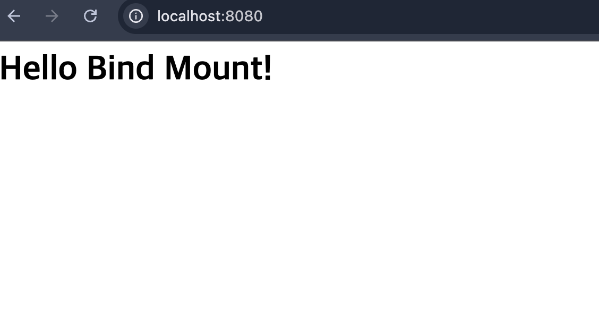
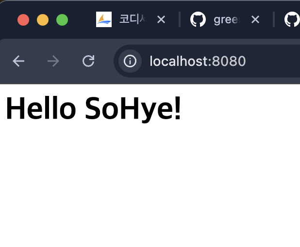
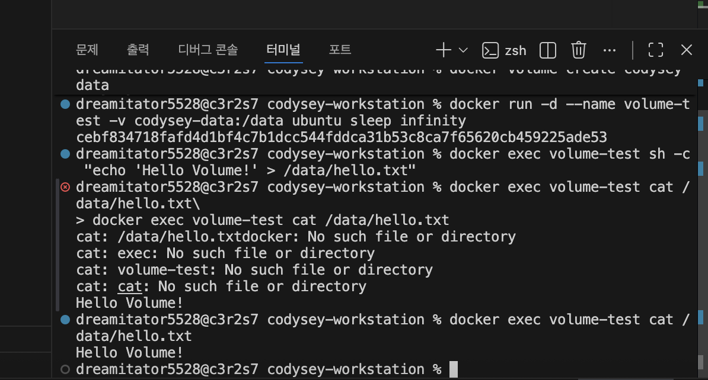
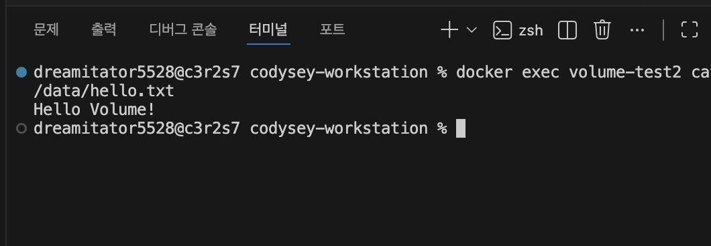
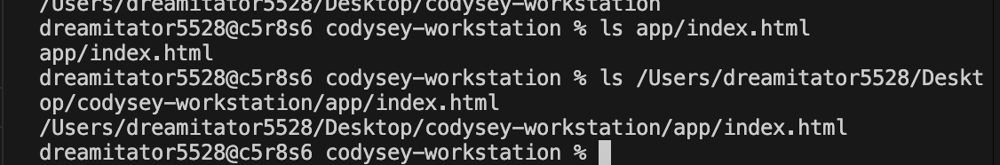

# Codyssey 개발 워크스테이션 구축 미션

이 문서는 평가 항목을 위에서부터 그대로 읽고 답할 수 있도록 구성했다. 기존 실습을 읽기 쉽게 다시 정리한 부분에는 **(보완)**, 새로 작성한 설명과 재현 절차에는 **(추가)**를 표시했다.

## 평가 결과 요약

| 항목 | 확인 결과 | 근거 |
| --- | --- | --- |
| 1. 기능 동작 검증 | 기존 macOS/OrbStack 실습 완료, 재현 명령 정리 | 터미널·Docker·Git 실습 내용과 `docs/screenshots` |
| 2. 동작 구조 설계 | 설명 및 재현 파일 추가 | `Dockerfile`, `compose.yaml`, `scripts/verify-docker.sh` |
| 3. 핵심 기술 원리 적용 | 네 질문에 대한 답변 추가 | 아래 「핵심 기술 원리」 절 |
| 4. 심층 인터뷰 | 세 질문에 대한 답변 추가 | 아래 「심층 인터뷰」 절 |

> 검증 기준 환경은 기존 실습을 수행한 **macOS + OrbStack + Docker 28.5.2**이다. 2026-08-21에 README를 정비한 Windows 작업 환경에는 Docker CLI가 없어 기존 Docker 증빙을 확인하고 재현 스크립트를 정적 검사했다. Docker가 있는 환경에서는 아래 한 줄로 전체 동작을 다시 검증할 수 있다.

```bash
bash scripts/verify-docker.sh | tee docker-verification.log
```

## 프로젝트 구조

```text
codysey-workstation/
├── app/
│   └── index.html              # nginx가 제공하는 정적 페이지
├── docs/
│   └── screenshots/            # 터미널·경로·볼륨 검증 화면
├── scripts/
│   └── verify-docker.sh        # Docker 전체 재검증 자동화
├── .github/workflows/
│   └── docker-verification.yml # 원격 Docker 검증과 PNG 증빙 생성
├── .gitignore
├── compose.yaml                # 포트·볼륨 설정의 재현 파일
├── Dockerfile                  # nginx 이미지 빌드 명세
├── image.png                   # localhost:8080 접속 증빙
└── README.md
```

---

## 항목 1. 기능 동작 검증

### (보완) 터미널에서 기본 명령어로 폴더/파일 생성·이동·삭제를 수행한 흔적이 있는가?

있다. `mkdir`로 폴더를 만들고, `touch`와 `echo`로 파일을 생성했으며, `cp`, `mv`, `rm`으로 복사·이름 변경·이동·삭제했다.

```bash
mkdir -p terminal-practice/practice-room
cd terminal-practice/practice-room
touch empty.txt
echo "Hello Terminal" > message.txt
cp message.txt message-copy.txt
mv message-copy.txt copied-message.txt
mkdir -p backup
mv copied-message.txt backup/
rm backup/copied-message.txt
ls -al backup
cd ../..
```

마지막 `ls -al backup`에서 복사본이 보이지 않으면 삭제가 완료된 것이다.





### (보완) 파일 권한 변경 결과가 확인되는가?

있다. 기존 실습에서는 파일을 `600`, 디렉터리를 `700`으로 변경했다. 변경 전후는 `ls -l`로 확인한다.

```bash
chmod 600 app/index.html
mkdir -p permission-test-dir
chmod 700 permission-test-dir
ls -ld app/index.html permission-test-dir
```

예상 결과의 권한 부분은 각각 `-rw-------`와 `drwx------`이다. 다만 웹 서버가 비소유자 권한으로 파일을 읽는 환경에서는 `600`이 접속 실패를 일으킬 수 있으므로 실습 확인 후 웹 파일은 `chmod 644 app/index.html`로 복구한다.

### (보완) `docker -version`이 출력되고, Docker가 동작 가능한 상태인가?

의도한 올바른 명령은 하이픈 두 개인 `docker --version`이다. 기존 실습 결과는 `Docker version 28.5.2, build ecc6942`였고, `docker info`에서 서버 정보가 출력되어 CLI뿐 아니라 Docker daemon도 동작함을 확인했다. `docker --version`만 성공하고 `docker info`가 실패하면 CLI만 설치되고 daemon은 꺼진 상태일 수 있다.

```bash
docker --version
docker info
```



### (보완) `docker run hello-world`가 정상 실행되는가?

정상 실행되었다. 출력의 `Hello from Docker!`는 클라이언트가 daemon에 연결되고, 이미지 pull·컨테이너 생성·프로그램 실행·출력 전달까지 모두 성공했다는 뜻이다.

```bash
docker run --name codysey-hello hello-world
docker logs codysey-hello
```



### (보완) 이미지/컨테이너 목록 확인 및 정리 흔적이 있는가?

다음 순서로 실행 전후 목록과 정리 결과를 확인한다. `docker ps`는 실행 중인 컨테이너, `docker ps -a`는 종료된 컨테이너까지, `docker images`는 로컬 이미지를 보여준다.

```bash
docker images
docker ps -a
docker rm codysey-hello
docker image rm hello-world:latest
docker images
docker ps -a
```

전체 미사용 리소스를 무조건 삭제하는 `docker system prune -a` 대신, 실습에서 만든 이름을 지정해 삭제하여 다른 프로젝트의 데이터를 보호한다. 자동 검증 스크립트도 자신이 만든 컨테이너·이미지·볼륨만 정리한다.

### (보완) Dockerfile로 이미지 빌드가 가능한가?

가능하다. 현재 `Dockerfile`은 Ubuntu에 nginx를 설치하고 `app/index.html`을 복사한 뒤 80번 포트에서 nginx를 포그라운드로 실행한다.

```bash
docker build -t codysey-nginx:mission .
docker image inspect codysey-nginx:mission
```

`docker build`가 종료 코드 0으로 끝나고 `docker image inspect`가 이미지 정보를 반환하면 빌드 성공이다.

### (보완) 매핑된 포트로 접속이 가능한가?

가능하다. `-p 8080:80`은 호스트의 8080번 포트를 컨테이너의 80번 포트로 전달한다.

```bash
docker run -d --name codysey-web -p 8080:80 codysey-nginx:mission
docker ps --filter name=codysey-web
curl --fail http://localhost:8080
```

`docker ps`에 `0.0.0.0:8080->80/tcp`가 보이고 `curl`에서 `Hello SoHye!`가 출력되면 성공이다.



이 캡처는 `COPY` 적용 전 nginx 기본 화면을 띄운 초기 포트 매핑 실습 증빙이다. 현재 Dockerfile을 다시 빌드하면 `app/index.html`이 복사되므로 응답 본문은 `Hello SoHye!`로 바뀐다.

### (보완) bind mount에서 호스트 파일 변경이 바로 반영되는가?

반영된다. 기존 실습에서는 호스트의 `app` 폴더를 nginx 문서 루트에 연결하고, `app/index.html`을 수정한 뒤 브라우저를 새로 고쳐 `Hello Bind Mount!`가 `Hello SoHye!`로 바뀐 것을 확인했다.

```bash
docker run -d --name codysey-bind -p 8080:80 \
  -v "$(pwd)/app:/var/www/html" \
  codysey-nginx:mission
docker inspect codysey-bind
curl --fail http://localhost:8080
```

`docker inspect`의 mount 정보에서 `Source`는 호스트의 `app`, `Destination`은 `/var/www/html`이어야 한다. bind mount는 호스트 원본을 직접 연결하므로 파일 변경이 재빌드 없이 반영되지만, 컨테이너와 독립적인 데이터 저장이 목적이면 named volume이 더 적합하다.





### (보완) Docker 볼륨 데이터가 컨테이너 삭제 후에도 유지되는가?

유지된다. 데이터는 컨테이너의 쓰기 계층이 아니라 Docker가 관리하는 named volume `codysey-data`에 저장된다. 첫 번째 컨테이너에서 파일을 쓴 후 그 컨테이너를 삭제하고, 같은 볼륨을 두 번째 컨테이너에 연결해 파일을 다시 읽었다.

```bash
docker volume create codysey-data
docker run --name volume-test -v codysey-data:/data ubuntu \
  sh -c 'echo "Hello Volume!" > /data/hello.txt'
docker rm volume-test
docker run --name volume-test2 -v codysey-data:/data ubuntu \
  cat /data/hello.txt
docker rm volume-test2
docker volume rm codysey-data
```

두 번째 컨테이너에서 `Hello Volume!`이 출력되므로 첫 번째 컨테이너 삭제 후에도 데이터가 유지된 것을 확인했다.





### (보완) Git 설정 및 GitHub 연동이 확인되는가?

확인된다. 현재 브랜치는 `main`, 추적 브랜치는 `origin/main`, 원격 저장소는 `https://github.com/greenable-7/codysey-workstation.git`이다. 실제 커밋 이력이 있으므로 로컬 Git 버전 관리와 GitHub 원격 연동 흔적이 모두 존재한다.

```bash
git --version
git config --get user.name
git config --get user.email
git status --short --branch
git remote -v
git log -3 --oneline
```

`git status`의 `main...origin/main`은 로컬 `main`이 원격 추적 브랜치 `origin/main`과 연결되어 있다는 뜻이다. `git remote -v`에서는 fetch와 push 주소를 모두 확인한다.

---

## 항목 2. 동작 구조 설계

### (추가) 프로젝트 디렉터리 구조를 어떤 기준으로 구성했는지 설명할 수 있는가?

역할과 변경 주기를 기준으로 분리했다. 웹 콘텐츠는 `app/`, 실행 환경 명세는 루트의 `Dockerfile`과 `compose.yaml`, 반복 검증은 `scripts/`, 사람이 확인할 증빙은 `docs/screenshots/`에 둔다. 이렇게 나누면 애플리케이션 내용, 인프라 설정, 검증 코드, 증빙 자료가 섞이지 않는다. 저장소 루트가 Docker build context이므로 `COPY app/index.html ...`도 같은 상대 경로로 재현된다.

### (추가) 포트/볼륨 설정을 어떤 방식으로 재현 가능하게 정리했는지 설명할 수 있는가?

일회성 명령은 README에 남기고, 반복 실행할 설정은 `compose.yaml`에 선언했다. 웹 서비스는 `${HOST_PORT:-8080}:80`으로 호스트 포트를 환경 변수로 바꿀 수 있고, 볼륨 검증 서비스는 `codysey-data:/data` named volume을 사용한다.

```bash
# 기본 8080 포트
docker compose up -d --build

# 8080이 이미 사용 중이면 8081로 재현
HOST_PORT=8081 docker compose up -d --build

# 컨테이너만 삭제: named volume은 유지
docker compose down

# 실습을 완전히 정리할 때만 볼륨까지 삭제
docker compose down --volumes
```

`scripts/verify-docker.sh`는 버전·daemon·hello-world·build·port·volume·목록·정리 검증을 같은 순서로 자동 실행하므로 사람마다 명령 순서가 달라지는 문제도 줄인다.

---

## 항목 3. 핵심 기술 원리 적용

### (추가) 이미지와 컨테이너의 차이를 빌드/실행/변경 관점에서 구분해 설명할 수 있는가?

- **빌드:** `docker build`가 Dockerfile을 읽어 변경 불가능한 이미지 레이어를 만든다. 이미지는 실행 환경의 설계도이자 배포 단위다.
- **실행:** `docker run`이 이미지 위에 쓰기 가능한 얇은 계층을 추가해 컨테이너를 만든다. 같은 이미지에서 여러 컨테이너를 독립적으로 실행할 수 있다.
- **변경:** 실행 중 컨테이너에서 만든 파일은 기본적으로 그 컨테이너의 쓰기 계층에만 있다. 컨테이너를 삭제하면 함께 사라진다. 변경을 다음 이미지에 반영하려면 Dockerfile을 고쳐 다시 빌드하고, 데이터를 유지하려면 volume이나 bind mount를 사용해야 한다.

### (추가) 컨테이너 내부 포트로 직접 접속할 수 없는 이유와 포트 매핑이 필요한 이유를 설명할 수 있는가?

컨테이너는 호스트와 분리된 네트워크 네임스페이스와 자체 IP·포트를 가진다. 그래서 컨테이너의 `80`번 포트는 곧바로 호스트의 `localhost:80`을 뜻하지 않으며, 외부에서 임의로 접근할 수 없다. `-p 8080:80`으로 호스트가 듣는 8080번 포트와 컨테이너의 80번 포트 사이에 전달 규칙을 만들어야 브라우저가 `http://localhost:8080`으로 접근할 수 있다. `EXPOSE 80`은 문서 역할을 할 뿐 실제 호스트 포트를 열지는 않는다.

### (보완) 절대 경로/상대 경로를 어떤 상황에서 선택하는지 설명할 수 있는가?

절대 경로는 루트부터 전체 위치를 표현하므로 현재 작업 디렉터리가 바뀌어도 같은 대상을 가리킨다. cron, 배포 스크립트, 외부 볼륨 연결처럼 실행 위치가 달라질 수 있을 때 선택한다. 상대 경로는 현재 디렉터리를 기준으로 짧고 이동 가능한 표현이므로 저장소 내부 파일, Docker build context, 팀원이 다른 위치에 clone하는 프로젝트에서 선택한다.

```bash
# 상대 경로: 저장소 루트에서 사용
ls app/index.html

# 기존 macOS 실습의 절대 경로
ls /Users/dreamitator5528/Desktop/codysey-workstation/app/index.html
```



### (보완) 파일 권한 숫자 표기(예: 755, 644)가 어떤 규칙으로 결정되는지 설명할 수 있는가?

세 자리는 순서대로 소유자(user), 그룹(group), 기타 사용자(others) 권한이다. 각 자리에서 읽기 `r=4`, 쓰기 `w=2`, 실행 `x=1`을 더한다.

| 숫자 | 계산 | 기호 | 의미 |
| --- | --- | --- | --- |
| `755` | `7(4+2+1)`, `5(4+1)`, `5(4+1)` | `rwxr-xr-x` | 소유자는 전부 가능, 나머지는 읽기·실행 가능 |
| `644` | `6(4+2)`, `4`, `4` | `rw-r--r--` | 소유자는 읽기·쓰기, 나머지는 읽기만 가능 |
| `600` | `6`, `0`, `0` | `rw-------` | 소유자만 읽기·쓰기 가능 |
| `700` | `7`, `0`, `0` | `rwx------` | 소유자만 디렉터리 접근·변경 가능 |

디렉터리의 `x`는 프로그램 실행이 아니라 그 디렉터리 안으로 진입하고 항목에 접근할 수 있는 권한을 뜻한다.

---

## 항목 4. 심층 인터뷰

### (추가) “호스트 포트가 이미 사용 중”이라 포트 매핑이 실패한다면, 어떤 순서로 원인을 진단할 것인가?

1. 오류 메시지에서 충돌 포트가 정말 8080인지 확인한다.
2. `docker ps --format 'table {{.Names}}\t{{.Ports}}'`로 다른 컨테이너가 8080을 사용 중인지 확인한다.
3. macOS/Linux에서는 `lsof -nP -iTCP:8080 -sTCP:LISTEN`, Windows에서는 `Get-NetTCPConnection -LocalPort 8080`으로 호스트 프로세스를 찾는다.
4. 그 서비스가 불필요하면 정상 종료한다. 다른 프로젝트의 컨테이너나 프로세스를 무작정 강제 삭제하지 않는다.
5. 종료할 수 없으면 컨테이너 내부 포트는 그대로 두고 호스트 포트만 바꿔 `-p 8081:80` 또는 `HOST_PORT=8081 docker compose up -d`로 실행한다.
6. `docker ps`, `curl --fail http://localhost:8081`, 브라우저 순서로 매핑과 응답을 재확인한다.

즉, **오류 확인 → Docker 점유 확인 → 호스트 점유 확인 → 안전한 종료 또는 포트 변경 → 재검증** 순서다.

### (추가) 컨테이너 삭제 후 데이터가 사라진 경험이 있다면, 이를 방지하기 위한 대안은 무엇인가?

컨테이너 내부 쓰기 계층에만 저장한 데이터는 컨테이너 삭제와 함께 사라진다. 운영 데이터나 Docker가 관리하기 적합한 데이터베이스 파일은 named volume에 저장하고, 소스 코드처럼 호스트에서 직접 편집해야 하는 파일은 bind mount로 연결한다. 중요한 데이터는 volume만 믿지 않고 별도 백업과 복구 테스트도 수행한다. 이 미션에서는 `codysey-data:/data`를 사용했고, 컨테이너를 교체한 뒤에도 `hello.txt`가 남아 있음을 확인했다.

### (추가) 이 미션에서 가장 어려웠던 지점과 해결 과정(가설 > 확인 > 조치)을 근거와 함께 설명할 수 있는가?

가장 어려웠던 지점은 “컨테이너를 삭제하면 데이터도 함께 사라지는가?”를 구분하는 일이었다.

- **가설:** `/data/hello.txt`를 컨테이너 내부에만 만들면 컨테이너 삭제 시 사라지지만, named volume에 만들면 새 컨테이너에서도 읽을 수 있을 것이다.
- **확인:** `codysey-data:/data`를 연결한 첫 컨테이너에서 `Hello Volume!`을 저장하고 읽은 뒤 컨테이너를 삭제했다. 같은 볼륨을 연결한 두 번째 컨테이너에서 다시 `cat /data/hello.txt`를 실행했다.
- **조치:** 영속 데이터 경로를 컨테이너 쓰기 계층이 아니라 named volume으로 선언했다. 삭제 전·후 출력은 `volume-before-delete.png`, `volume-after-delete.png`로 남겼다.
- **결과:** 새 컨테이너에서도 `Hello Volume!`이 출력되어 가설을 확인했다. 앞으로 영속 데이터는 volume에 두고, `docker compose down --volumes`는 데이터를 정말 폐기할 때만 사용한다.

문서 정비 과정에서 README 한글 인코딩이 깨지고 병합 충돌 표식이 남은 문제도 발견했다. Git 이전 커밋의 정상 UTF-8 내용을 확인한 뒤, 기존 증빙을 보존하면서 문서를 UTF-8로 다시 구성하고 충돌 표식을 제거했다.

---

## 전체 Docker 재검증 절차

### (추가) 자동 테스트

Docker daemon이 실행 중인 macOS/Linux 환경에서 실행한다.

```bash
bash scripts/verify-docker.sh | tee docker-verification.log
```

성공 기준은 마지막에 `[PASS] all Docker checks completed`가 출력되는 것이다. 스크립트는 다음 순서를 실제 수행한다.

1. Docker CLI와 daemon 확인
2. `hello-world` 실행
3. Dockerfile 이미지 빌드
4. `8080:80` 포트 매핑과 HTTP 본문 확인
5. named volume에 데이터 쓰기
6. 작성 컨테이너 삭제
7. 새 컨테이너에서 같은 데이터 읽기
8. 이미지·컨테이너·볼륨 목록 확인
9. 테스트가 만든 리소스만 정리하고 정리 후 목록 확인

### (추가) 스크린샷 체크리스트

평가 제출 시 한 화면에 명령과 성공 결과가 함께 보이도록 캡처한다.

- `docker --version`과 `docker info` 서버 정보
- `docker run hello-world`의 `Hello from Docker!`
- `docker build`의 성공 마지막 줄과 `docker images`
- `docker ps`의 `8080->80` 및 브라우저 `localhost:8080`
- 첫 컨테이너 삭제 전 `Hello Volume!`
- 새 컨테이너에서 다시 출력된 `Hello Volume!`
- 정리 전후 `docker ps -a`, `docker images`, `docker volume ls`

기존 제출 증빙은 `docs/screenshots/`와 `image.png`에서 확인할 수 있다.

### (추가) 로컬에 Docker가 없을 때 원격 검증

`.github/workflows/docker-verification.yml`은 Docker 관련 파일이 `main`에 push되면 자동 실행되며, 필요하면 **Actions → Docker verification evidence → Run workflow**에서 수동으로도 실행할 수 있다. Ubuntu 환경에서 Dockerfile을 실제 빌드·실행한 뒤 성공 로그와 PNG 증빙을 저장소에 커밋한다. 증빙만 추가한 후속 커밋은 workflow 경로 필터에 포함되지 않으므로 반복 실행되지 않는다.

성공한 실행의 **Artifacts → docker-verification-evidence**에는 다음 파일이 생성된다.

- `docker-verification.log`: 전체 Docker 명령과 `[PASS]` 결과
- `docker-verification.png`: 터미널 검증 로그 스크린샷
- `docker-port-live.png`: 실행 중인 컨테이너의 `localhost:8080` 실제 화면

검증 성공 후 같은 파일은 `docs/docker-verification.log`, `docs/screenshots/docker-verification.png`, `docs/screenshots/docker-port-live.png`에도 자동 저장된다.

이 방법은 로컬 Docker가 없는 PC에서도 Docker daemon이 있는 GitHub runner에서 빌드·포트·볼륨·정리 동작을 실제 검증한다. 다만 제출용 증빙으로 사용할 때는 성공한 workflow run 주소도 함께 기록한다.
